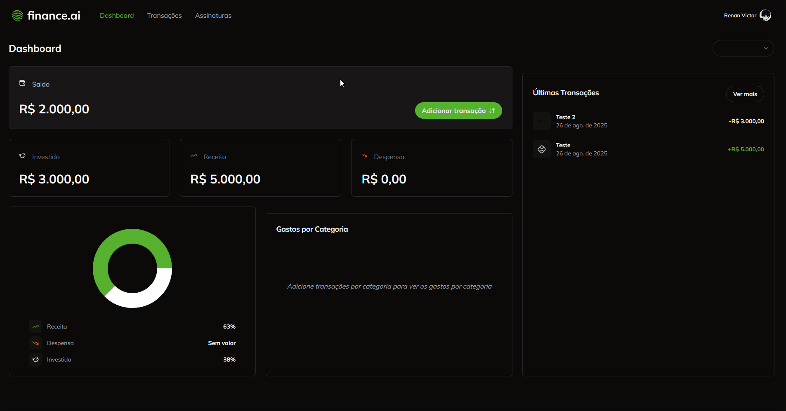

#  Finance AI

<div align="center">
<div >


</div>

#

<div >


</div>

#



</div>

## 📖 Descrição

A **Finance AI** é uma plataforma de gestão financeira que ajuda você a monitorar, organizar e analisar suas movimentações financeiras de forma **simples, intuitiva e com inteligência de dados**.

---

## ✨ Funcionalidades

### 🔐 Autenticação

- Cadastro e login usando **Clerk**
- Gerenciamento de perfil
- Rotas protegidas para usuários autenticados

### 💲 Gerenciamento de transações

- Criação de transações
- Edição de transações
- Exclusão de transações

### 📊 Análise de movimentações financeiras

- Visualização de movimentações financeiras
- Visualização de gastos por categoria
- Visualização de transações por mês
- Cálculo de depósitos, investimentos e despesas
- Exibição de saldo total

### 🖋️ Assinatura

- Assinatura via **Stripe**
- Sem limitações de transações para assinantes

### 📱 Design responsivo

- Totalmente responsivo para todos os dispositivos

---

## 🛠️ Tecnologias utilizadas

- **Frontend**: React, Next.js, TailwindCSS
- **Backend**: Prisma, PostgreSQL
- **Autenticação**: Clerk
- **Pagamentos**: Stripe
- **Deploy**: Vercel

---

## 📦 Instalação

```bash
# 1. Clone o repositório
git clone https://github.com/renan22Rsw/finance-ai.git

# 2. Acesse a pasta do projeto
cd finance-ai

# 3. Instale as dependências
npm install
# ou
yarn install

# 4. Inicie o servidor de desenvolvimento
npm run dev
# ou
yarn dev
```
